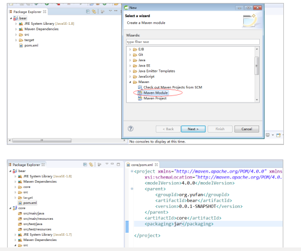

# 天成商城

### 项目介绍
电商项目开发学习
只实现了部分功能。

### 功能

### 软件架构
软件架构说明：分布式系统架构

### 各个系统说明

### 开发流程

### 搭建工程
#### 搭建父工程

#### 搭建core工程

#### 搭建admin工程

### 搭建ssm环境
#### 搭建dao环境

#### 配置事物

#### 配置springmvc.xml

#### 配置web.xml

### 测试
#### maven方式
在admin的pom.xml中配置

### 整合通用mapper

使用

### 整合分页助手

### 配置日期转换器和统一的异常处理
#### 配置日期转换器

#### 编写统一的异常处理

编写自定义异常处理器

### 后台静态页面
#### 编写通用的页面跳转

#### 配置不拦截静态资源

web.xml版本2.5以上，否则会有bug。

### 开发添加商品
#### 分析选择类目的js

前端需要的数据

#### 开发后台接口
##### 表设计
树状结构

##### 编写mapper

##### 编写service

##### 编写comtroller

### Nginx
#### 什么是nginx
	Nginx (engine x) 是一个高性能的HTTP和反向代理服务，也是一个IMAP/POP3/SMTP服务。Nginx是由伊戈尔·赛索耶夫为俄罗斯访问量第二的Rambler.ru站点（俄文：Рамблер）开发的，第一个公开版本0.1.0发布于2004年10月4日。
其将源代码以类BSD许可证的形式发布，因它的稳定性、丰富的功能集、示例配置文件和低系统资源的消耗而闻名。2011年6月1日，nginx 1.0.4发布。
	Nginx是一款轻量级的Web 服务器/反向代理服务器及电子邮件（IMAP/POP3）代理服务器，并在一个BSD-like 协议下发行。其特点是占有内存少，并发能力强，事实上nginx的并发能力确实在同类型的网页服务器中表现较好，中国大陆使用nginx网站用户有：百度、京东、新浪、网易、腾讯、淘宝等。

#### nginx应用场景
    1. http服务器。 nginx是一个服务器可以独立提供http服务，可以做静态(静态资源)服务器。
    2. 虚拟主机  可以实现一台服务器虚拟出多个网站。
    3. 反向代理，负载均衡。  当网站的访问量达到一定的程度以后，单台服务器不能满足用户的请求，需要多态服务器的集群，可以使用nginx做反向代理，并且多态服务器可以平均负载，不会因为某台服务器宕机而崩溃。

#### http服务器

#### 配置虚拟主机(端口)

#### 配置虚拟主机（域名）

#### 反向代理

#### 正向代理

#### 配置反向代理

nginx  -s  reload   重新加载配置文件

#### 负载均衡策略
1、轮询（默认）
每个请求按时间顺序逐一分配到不同的后端服务器，如果后端服务器down掉，能自动剔除。 
upstream backserver { 
server 192.168.0.14; 
server 192.168.0.15; 
} 

2、指定权重
指定轮询几率，weight和访问比率成正比，用于后端服务器性能不均的情况。 
upstream backserver { 
server 192.168.0.14 weight=10; 
server 192.168.0.15 weight=10; 
}

3、IP绑定 ip_hash
每个请求按访问ip的hash结果分配，这样每个访客固定访问一个后端服务器，可以解决session的问题。 
upstream backserver { 
ip_hash; 
server 192.168.0.14:88; 
server 192.168.0.15:80; 
} 

4、fair（第三方）
按后端服务器的响应时间来分配请求，响应时间短的优先分配。 
upstream backserver { 
server server1; 
server server2; 
fair; 
} 

5、url_hash（第三方）
按访问url的hash结果来分配请求，使每个url定向到同一个后端服务器，后端服务器为缓存时比较有效。 
upstream backserver { 
server squid1:3128; 
server squid2:3128; 
hash $request_uri; 
hash_method crc32; 
} 

### 封装BaseService
#### 编写接口 

#### 编写实现类

#### 使用

#### 新增商品
商品表 sku库存

