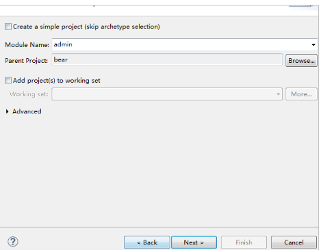
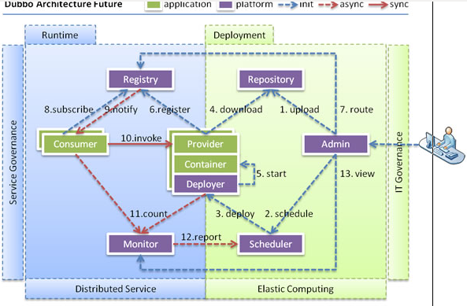
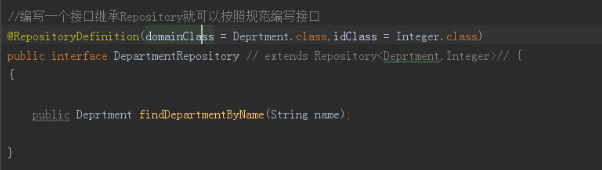
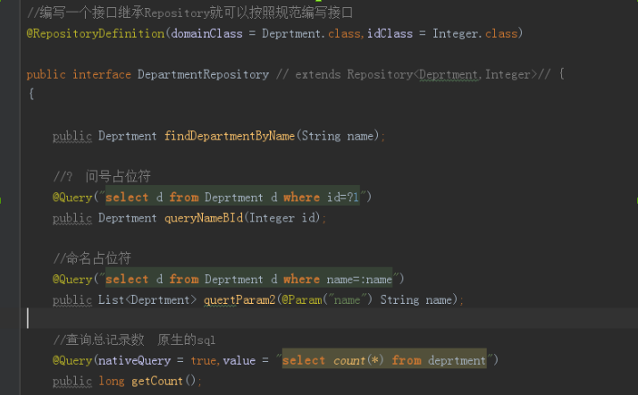
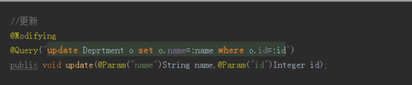
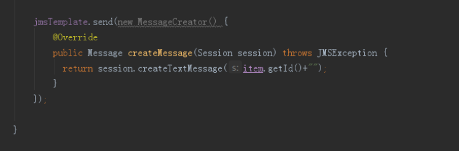

# 天成商城

### 一、项目介绍
电商项目开发学习
只实现了部分功能。

### 二、功能

### 三、软件架构
软件架构说明：分布式系统架构

### 四、各个系统说明

### 五、开发流程

### 六、搭建工程
#### 6.1搭建父工程

#### 6.2搭建core工程

#### 6.3搭建admin工程

### 七、搭建ssm环境
#### 7.1搭建dao环境

#### 7.2配置事物

#### 7.3配置springmvc.xml

#### 7.4配置web.xml

### 八、测试
#### 8.1maven方式
在admin的pom.xml中配置

### 九、整合通用mapper

使用

### 十、整合分页助手

### 十一、配置日期转换器和统一的异常处理
#### １１．１配置日期转换器

#### １１．２编写统一的异常处理

编写自定义异常处理器

### 十二、后台静态页面
#### １２．１编写通用的页面跳转

#### １２．２配置不拦截静态资源

web.xml版本2.5以上，否则会有bug。

### 十三、开发添加商品
#### １３．１分析选择类目的js

前端需要的数据

###　十四、开发后台接口
#### １４．１表设计
树状结构

####　１４．２编写mapper

#### １４．３编写service

#### １４．４编写comtroller

### 十五、Nginx
#### １５．１什么是nginx
	Nginx (engine x) 是一个高性能的HTTP和反向代理服务，也是一个IMAP/POP3/SMTP服务。Nginx是由伊戈尔·赛索耶夫为俄罗斯访问量第二的Rambler.ru站点（俄文：Рамблер）开发的，第一个公开版本0.1.0发布于2004年10月4日。
其将源代码以类BSD许可证的形式发布，因它的稳定性、丰富的功能集、示例配置文件和低系统资源的消耗而闻名。2011年6月1日，nginx 1.0.4发布。
	Nginx是一款轻量级的Web 服务器/反向代理服务器及电子邮件（IMAP/POP3）代理服务器，并在一个BSD-like 协议下发行。其特点是占有内存少，并发能力强，事实上nginx的并发能力确实在同类型的网页服务器中表现较好，中国大陆使用nginx网站用户有：百度、京东、新浪、网易、腾讯、淘宝等。

#### １５．２nginx应用场景
    1. http服务器。 nginx是一个服务器可以独立提供http服务，可以做静态(静态资源)服务器。
    2. 虚拟主机  可以实现一台服务器虚拟出多个网站。
    3. 反向代理，负载均衡。  当网站的访问量达到一定的程度以后，单台服务器不能满足用户的请求，需要多态服务器的集群，可以使用nginx做反向代理，并且多态服务器可以平均负载，不会因为某台服务器宕机而崩溃。

#### １５．３http服务器

#### １５．４配置虚拟主机(端口)

#### １５．５配置虚拟主机（域名）

#### １５．６反向代理

#### １５．７正向代理

#### １５．８配置反向代理

nginx  -s  reload   重新加载配置文件

#### １５．９负载均衡策略
1、轮询（默认）
每个请求按时间顺序逐一分配到不同的后端服务器，如果后端服务器down掉，能自动剔除。 
upstream backserver { 
server 192.168.0.14; 
server 192.168.0.15; 
} 

2、指定权重
指定轮询几率，weight和访问比率成正比，用于后端服务器性能不均的情况。 
upstream backserver { 
server 192.168.0.14 weight=10; 
server 192.168.0.15 weight=10; 
}

3、IP绑定 ip_hash
每个请求按访问ip的hash结果分配，这样每个访客固定访问一个后端服务器，可以解决session的问题。 
upstream backserver { 
ip_hash; 
server 192.168.0.14:88; 
server 192.168.0.15:80; 
} 

4、fair（第三方）
按后端服务器的响应时间来分配请求，响应时间短的优先分配。 
upstream backserver { 
server server1; 
server server2; 
fair; 
} 

5、url_hash（第三方）
按访问url的hash结果来分配请求，使每个url定向到同一个后端服务器，后端服务器为缓存时比较有效。 
upstream backserver { 
server squid1:3128; 
server squid2:3128; 
hash $request_uri; 
hash_method crc32; 
} 

### 十六、封装BaseService
#### １６．１编写接口 

#### １６．２编写实现类

#### １６．３使用

### 十七、新增商品
商品表 sku库存

#### １７．１编写mapper和service
#### １７．２图片上传js分析

返回的数据结构

####　１７．３编写上传图片的接口
##### １７．３．１配置nginx

##### １７．３．２注意配置上传图片的解析器

##### １７．３．３准备返回结果的对象

### 十八、提交商品
#### １８．１编写接口

#### １８．２回显的js

#### １８．３提交商品

### 十九、商品列表和编辑
#### １９．１需要的接口

需要的数据格式

#### １９．２封装easyUIResult

#### １９．３编写接口

#### １９．４商品编辑的回显

后台编写接口

#### １９．５图片的回显

#### １９．４商品修改的提交

### 二十、架构完善
#### ２０．１统一的结果集返回

#### ２０．２改造统一的异常处理

### 二十一、日志
#### ２０．１日志框架
市面上的日志框架
     JUL,JCL,Jboss-logging ,logback,log4j,log4j2,sl4j....

日志门面
JCL    sl4j   Jboss-logging

日志的实现   
log4j   log4j2  logback
sl4j    使用最多的门面

日志实现

log4j   log4j2  logback

门面  slf4j    实现log4j

#### ２０．２上传图片添加日志

Spring父子容器

Spring核心  父容器

SpringMvc子容器

安全:

Service不能注入Controller

子容器无法获得父容器加载的properties文件!!!!!!

### 二十一、搭建前台系统
前台系统要求返回json数据的接口给前端（各种客户端）,不能操作操作数据库,需要调用后台系统的接口。

前台系统调用后台

    1. Webservice  xml交互  互联网淘汰
    2. http+json  调用
    3. Dubbo+zookpper  

#### ２１．１配置前台系统nginx
springmvc+spring

配置nginx

### 二十二、HttpClient(掌握)
导入jar包

#### ２２．１不带参数的get请求

#### ２２．２带参数的get请求

#### ２２．３post请求

#### ２２．４使用工具类改造异常处理

#### ２２．５后台系统开放接口

#### ２２．６前台系统调用

Dubbo+zookeeper

学习redis

做缓存

缓存

怎么通知前台系统

消息中间件

### 二十三、Dubbo
    1. WebService 效率不高基于soap协议，互联网项目不推荐使用。
    2. 使用resultful服务  http+json 很多项目应用   如果服务太多，服务间的调用复杂，需要服务治理。
    3. 使用dubbo，使用rpc协议进行远程调用，直接使用socket协议通信，传输效率高，并且可以统计出各个系统之间的调用关系，调用次数。

系统一定是用java写的

#### ２３．１什么是dubbo
随着互联网的发展，网站应用的规模不断扩大，常规的垂直应用架构已无法应对，分布式服务架构以及流动计算架构势在必行，亟需一个治理系统确保架构有条不紊的演进。

单一应用架构
当网站流量很小时，只需一个应用，将所有功能都部署在一起，以减少部署节点和成本。此时，用于简化增删改查工作量的数据访问框架(ORM)是关键。
垂直应用架构
当访问量逐渐增大，单一应用增加机器带来的加速度越来越小，将应用拆成互不相干的几个应用，以提升效率。此时，用于加速前端页面开发的Web框架(MVC)是关键。
分布式服务架构
当垂直应用越来越多，应用之间交互不可避免，将核心业务抽取出来，作为独立的服务，逐渐形成稳定的服务中心，使前端应用能更快速的响应多变的市场需求。此时，用于提高业务复用及整合的分布式服务框架(RPC)是关键。
流动计算架构
当服务越来越多，容量的评估，小服务资源的浪费等问题逐渐显现，此时需增加一个调度中心基于访问压力实时管理集群容量，提高集群利用率。此时，用于提高机器利用率的资源调度和治理中心(SOA)是关键。

节点角色说明
节点
角色说明
Provider
暴露服务的服务提供方
Consumer
调用远程服务的服务消费方
Registry
服务注册与发现的注册中心
Monitor
统计服务的调用次数和调用时间的监控中心
Container
服务运行容器

节点角色说明
节点
角色说明
Deployer
自动部署服务的本地代理
Repository
仓库用于存储服务应用发布包
Scheduler
调度中心基于访问压力自动增减服务提供者
Admin
统一管理控制台
Registry
服务注册与发现的注册中心
Monitor
统计服务的调用次数和调用时间的监控中心

#### ２３．２注册中心
Zookeeper 是 Apacahe Hadoop 的子项目，是一个树型的目录服务，支持变更推送，适合作为 Dubbo 服务的注册中心，工业强度较高，可用于生产环境，并推荐使用 [1]。

动物园管理员

    1. 可以作为集群的管理工具
    2. 可以集中管理配置文件

引入dubbo和zookpper的jar包

#### ２３．３配置服务的提供方

#### ２３．４配置服务的调用方

服务调用方需要和服务提供方一模一样的接口，包括包名。

### 二十四、Redis
#### ２４．１Redis介绍
NoSQL，泛指非关系型的数据库。随着互联网web2.0网站的兴起，传统的关系数据库在应付web2.0网站，特别是超大规模和高并发的SNS类型的web2.0纯动态网站已经显得力不从心，暴露了很多难以克服的问题，而非关系型的数据库则由于其本身的特点得到了非常迅速的发展。NoSQL数据库的产生就是为了解决大规模数据集合多重数据种类带来的挑战，尤其是大数据应用难题。
虽然NoSQL的流行与火起来才短短一年的时间，但是不可否认，现在已经开始了第二代运动。尽管早期的堆栈代码只能算是一种实验，然而现在的系统已经更加的成熟、稳定。不过现在也面临着一个严酷的事实：技术越来越成熟——以至于原来很好的NoSQL数据存储不得不进行重写，也有少数人认为这就是所谓的2.0版本。该工具可以为大数据建立快速、可扩展的存储库。

目前主流的nosql数据库

redis,memcahed,mongdb

1.缓存
1.redis
2.memcahed

二者的性能更好？
    1. 从缓存命中率来说memcahed更高，但是redis和memcahed相差不大。
    2. 但是，redis功能更加强大

#### ２４．２jedis

#### ２４．３jedis和spring整合

#### ２４．４缓存

#### ２４．５前台系统暴露删除缓存的接口

#### ２４．６后台系统更新商品的时候干掉缓存

消息中间件
### 二十五、Springdata jpa
#### ２５．１导包

#### ２５．２手动配置springDataJpa

#### ２５．３入门体验

#### ２５．４Repository  Spring  Data的核心注解
是一个空的接口，标记接口   没有包含任何方法的声明
方案一

方案二

Repository

CrudRepository   儿子  实现增删改查

PagingAndSortingRepository  孙子  排序和分页

JpaRepository  重孙   更强大

#### ２５．５Query注解

#### ２５．６实体注解的使用

### 二十六、单点登录系统
#### ２６．１表结构

#### ２６．２开发dao

### 二十七、注册
#### ２７．１注册service

#### ２７．２校验

#### ２７．３controller

#### ２７．４测试

###　二十八、登录
#### ２８．１登录service

#### ２８．２登录controller

#### ２８．３service

#### ２８．４controller

改进 忽略掉密码

#### ２８．５短信

#### ２８．６短信登录

#### ２８．７短信注册
    1. 发送短信的接口

发送注册短信

     1. 校验没有在我们的平台注册过
             发送短信
                  存储到redis 

    2. 短信注册的接口
              手机号码
              短信验证码

                校验没有在我们的平台注册过
                 
                     校验验证码
                     
                 处理注册
### 二十九、消息中间件
#### ２９．１jms规范
JMS即Java消息服务（Java Message Service）应用程序接口，是一个Java平台中关于面向消息中间件（MOM）的API，用于在两个应用程序之间，或分布式系统中发送消息，进行异步通信。Java消息服务是一个与具体平台无关的API，绝大多数MOM提供商都对JMS提供支持。
JMS是一种与厂商无关的 API，用来访问消息收发系统消息，它类似于JDBC(Java Database Connectivity)。这里，JDBC 是可以用来访问许多不同关系数据库的 API，而 JMS 则提供同样与厂商无关的访问方法，以访问消息收发服务。许多厂商都支持 JMS，包括 IBM 的 MQSeries、BEA的 Weblogic JMS service和 Progress 的 SonicMQ。 JMS 使您能够通过消息收发服务（有时称为消息中介程序或路由器）从一个 JMS 客户机向另一个 JMS客户机发送消息。消息是 JMS 中的一种类型对象，由两部分组成：报头和消息主体。报头由路由信息以及有关该消息的元数据组成。消息主体则携带着应用程序的数据或有效负载。根据有效负载的类型来划分，可以将消息分为几种类型，它们分别携带：简单文本(TextMessage)、可序列化的对象 (ObjectMessage)、属性集合 (MapMessage)、字节流 (BytesMessage)、原始值流 (StreamMessage)，还有无有效负载的消息 (Message)。
Jms提供者   jms接口的一个实现
Jms客户     生产或者发送消息的java应用程序
Jms生产者   创建并发送消息的客户
Jms消费者   接口jms消息的客户

Jms消息     可以在jms客户间传递的数据对象

Jms队列
Jms主题

MQ message queue 消息队列

队列   点对点  一个发送的  一个接收的 qq的私聊
主题   一对多   一个发送的   多个接收的 qq的群发

ActiveMq    RabbitMq  兔子MQ     Kafka     RocketMQ  

#### ２９．２ActiveMq
ActiveMQ 是Apache出品，最流行的，能力强劲的开源消息总线。ActiveMQ 是一个完全支持JMS1.1和J2EE 1.4规范的 JMS Provider实现，尽管JMS规范出台已经是很久的事情了，但是JMS在当今的J2EE应用中间仍然扮演着特殊的地位。

点对点    一个生生产者一个消费者
主题     一个生产者多个消费者

### 三十、admin发送消息
#### ３０．１步骤
由spring管理
第一步：工厂由apache提供
第二步： (可有可无) 有apache提供的连接池
    第三步：spring单例工厂
第四步:  spring jms templete操作mq
第五步：  注入spring jms templete

#### ３０．２导包

#### ３０．３配置

####  ３０．４front接收消息

